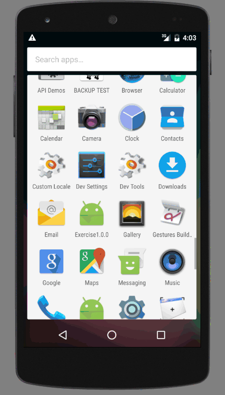

# 说明

开发环境： Linux + Android Studio 2.0 + Genymotion personal license with Android 6.x image + Nexus 5 simulator with Android 6.x image + Nexus 6 

支持Android最低版本  Ice Cream Sandwich 4.x 以上版本

使用 MaterialSeekBarPreference 依赖， MIT License。

使用预览，因模拟器重力感应限制，真机测试才有效。

